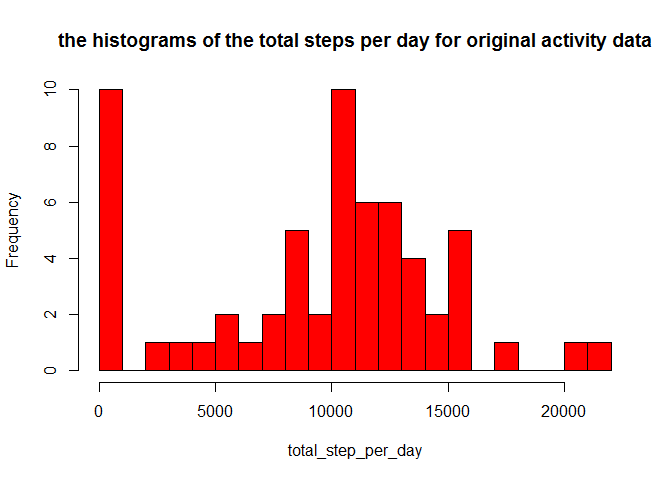
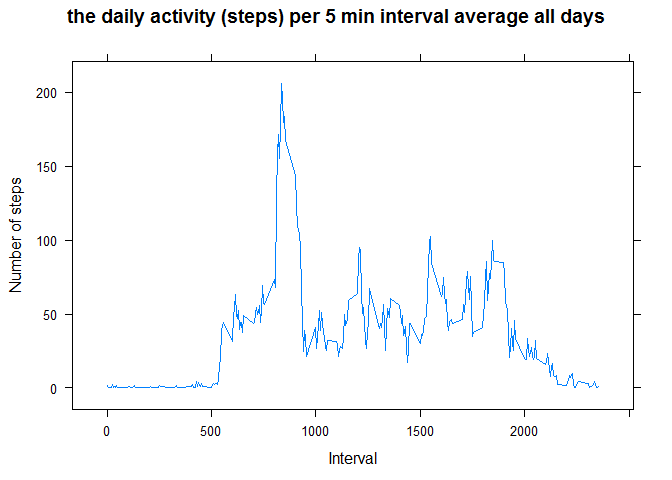
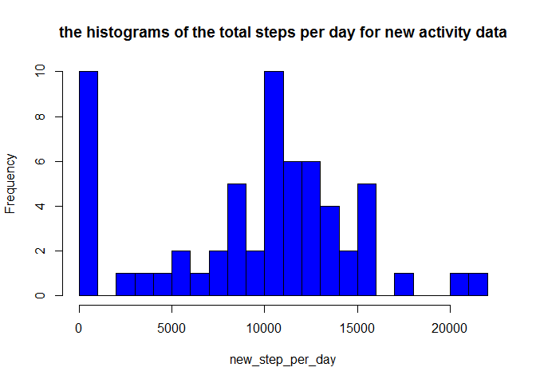
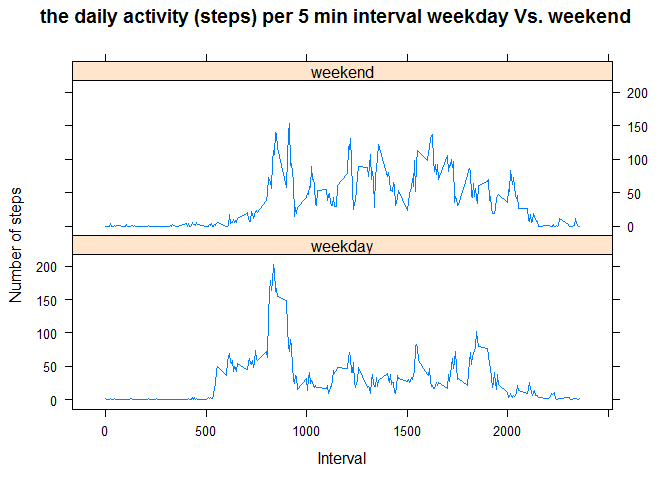

# Reproducible Research: Peer Assessment 1
YE Chen  


## Part 1 Loading and preprocessing the data


```r
# load the data from the activity.csv file, which is under the current diretory

activity_data<-read.csv("activity.csv")
```


## Part 2: What is mean total number of steps taken per day?


```r
# caculate the total number of the steps taken per day 
# get the 61 days in the data set
unique_date <-unique(activity_data$date)
total_step_per_day=c(1:length(unique_date))
mean_step_per_day=c(1:length(unique_date))
# get the total step per day and mean step per day
for (i in 1:length(unique_date))
{
  per_day_data<-subset(activity_data, date==unique_date[i])
  total_step_per_day[i]<-sum(per_day_data$steps,na.rm = TRUE)
  mean_step_per_day[i]<-mean(per_day_data$steps,na.rm = TRUE)
  
}
mean_total_step_per_day<-mean(total_step_per_day,na.rm= TRUE)
median_total_step_per_day<-median(total_step_per_day,na.rm = TRUE)
#plot histogram
hist(total_step_per_day,main = "the histograms of the total steps per day for original activity data",col = "red",breaks=20)
```

 

```r
#output to file , put into the subfolder called figure
  dev.copy(png,file="./figure/hist_original_activity_data.png")
```

```
## png 
##   3
```

```r
  dev.off()  # close it
```

```
## png 
##   2
```

###The mean of total steps per day is 9354.2295082
###the median of total steps per day is 10395


## Part 3:What is the average daily activity pattern?


```r
  # get the interval for each day, it is the same for all days in the activity dataset
interval<-subset(activity_data,date==unique_date[1])$interval
daily_mean_interval<-c(1:length(interval))

# calculate the average of all the days for a given interval 
for(i in 1:length(interval))
{
  daily_mean_interval [i] <-mean(subset(activity_data,interval==interval[i])$steps,na.rm = TRUE)
  
}

#get the maximum value and the index (mapped to interval)

max_mean<-max(daily_mean_interval)
max_mean_index<-which.max(daily_mean_interval)

#plot the time series figure for daily activity pattern per interval
# using lattice package

library(lattice)


xyplot(daily_mean_interval~interval,type = "l",xlab="Interval",ylab = "Number of steps",main="the daily activity (steps) per 5 min interval average all days")
```

 

```r
#output to file , put into the subfolder called figure
  dev.copy(png,file="./figure/daily_activity_pattern_per_interval.png")
```

```
## png 
##   3
```

```r
  dev.off()  # close it
```

```
## png 
##   2
```
### the maximum steps for daily activity pattern across all days with 5 min interval is 206.1698113
### the interval which has the maximum step for daily activity pattern across all days with 5 min interval is 835


## Part 4: Inputing missing values


```r
# calculate the number of missing value

total_num_na<-sum(is.na(activity_data$steps))

# fill the missing value, the streatgy is to use the mean step of that day to fill in the NA value for each day
# store in a new dataset called new_activity_data

new_activity_data<- activity_data
for(i in 1:nrow(new_activity_data))
{
  if(is.na(new_activity_data$steps[i]))
  {
    #get the index for that day
    given_day<-which(!is.na(match(unique_date,activity_data$date[i])))
    
    # if given_day is a valid index, set the missing value to the mean of that day
    # if the mean value is NaN, set to 0
    if(is.numeric(given_day)&& given_day>0)
    {
      if(is.nan(mean_step_per_day[given_day]))
        mean_step_per_day[given_day]<-0
      new_activity_data$steps[i]=mean_step_per_day[given_day]
    }
      
  }
    
}

# calculate the mean and median total number of steps taken per day for the new dataset
new_step_per_day=c(1:length(unique_date))
new_mean_step_per_day=c(1:length(unique_date))
for (i in 1:length(unique_date))
{
  per_day_data<-subset(new_activity_data, date==unique_date[i])
  new_step_per_day[i]<-sum(per_day_data$steps,na.rm = TRUE)
  new_mean_step_per_day[i]<-mean(per_day_data$steps,na.rm = TRUE)
  
}

new_mean_total_step_per_day<-mean(new_step_per_day,na.rm= TRUE)
new_median_total_step_per_day<-median(new_step_per_day,na.rm = TRUE)
# plot histogram
hist(new_step_per_day,main = "the histograms of the total steps per day for new activity data",col = "blue",breaks=20)
```

 

```r
#output to file , put into the subfolder called figure
  dev.copy(png,file="./figure/hist_new_activity_data.png")
```

```
## png 
##   3
```

```r
  dev.off()  # close it
```

```
## png 
##   2
```
###The new mean of total steps per day for the new activity data set (remove NA with mean of a day) is 9354.2295082
###The new median of total steps per day for the new activity data set (remove NA with mean of a day) is 1.0395\times 10^{4}
### based on the stragey used (use the mean step of that day to fill in the NA value for each day ), seems no difference between the original and new dataset

## Part 5: Are there differences in activity patterns between weekdays and weekends?


```r
# add a new colume to the new activity data called "whatday", set to two levels either weekday or weekend.
# use a new dataset new_activity_data1 with the new column (variable) called whatday, with value either "weekday" or "weekend"
weekend<-c("Saturday","Sunday")
new_activity_data1<-new_activity_data
  
for (i in 1:nrow(new_activity_data1))
{
  # if it is not either Sat or Sunday
  if(is.na(match(weekend,weekdays(as.Date(new_activity_data1$date[i]))))[1]&&is.na(match(weekend,weekdays(as.Date(new_activity_data1$date[i]))))[2])
    new_activity_data1$"whatday"[i]<-"weekday"
  else
    new_activity_data1$"whatday"[i]<-"weekend"
}
  
# get two subsets one is weekend and one is weekday
weekday_set<-subset(new_activity_data1,whatday=="weekday")
weekend_set<-subset(new_activity_data1, whatday=="weekend")

# for weekday, get the average across the same interval of all weekdays
interval<-subset(new_activity_data1,date==unique_date[1])$interval
weekday_mean_interval <-c(1:length(interval))
weekend_mean_interval <- c(1:length(interval))
for(i in 1:length(interval))
{
  weekday_mean_interval [i] <-mean(subset(weekday_set,interval==interval[i])$steps)
  weekend_mean_interval [i] <-mean(subset(weekend_set,interval==interval[i])$steps)
}

# plot the figure using xyplot
library(lattice)

plot_data<-c(weekday_mean_interval,weekend_mean_interval)
f<-rep(0:1,each=length(interval))
f<-factor(f,labels = c("weekday","weekend"))
x<-c(interval,interval)
xyplot(plot_data~x|f,layout=c(1,2),type = "l",xlab="Interval",ylab = "Number of steps",main="the daily activity (steps) per 5 min interval weekday Vs. weekend")
```

 

```r
#output to file , put into the subfolder called figure
  dev.copy(png,file="./figure/weekday_weekend.png")
```

```
## png 
##   3
```

```r
  dev.off()  # close it
```

```
## png 
##   2
```

### based on the figure showing the comparison, there are differences in activity patterns between weekdays and weekends
